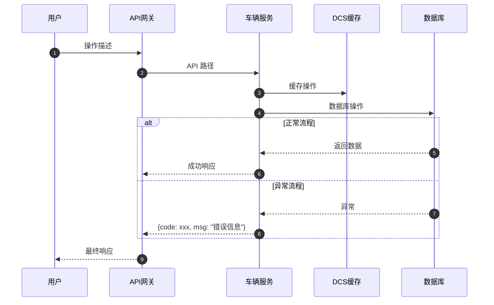
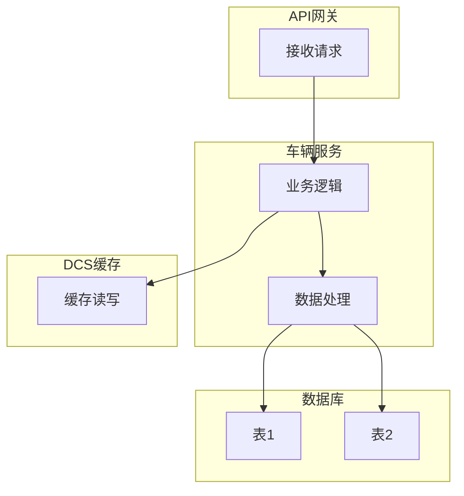

# code-to-business 格式规范与输出指南

本文件定义了电商业务分析过程中 LLM 输出的严格格式标准和脱敏要求。

## 1. 核心部分输出规范

### 1.1 时序图规范 (Sequence Diagram)
必须使用 Mermaid `sequenceDiagram` 语法。

### 1.2 泳道图规范 (Flowchart)
必须使用 Mermaid `graph TD` 语法，且必须标注各服务/数据库边界。

### 1.3 异常分支表规范
必须包含：异常场景、错误码、处理逻辑。

| 异常场景 | 错误码 | 处理逻辑 |
|----------|--------|----------|
| 参数校验失败 | 1001 | 返回参数错误提示 |
| 缓存未命中 | - | 降级查数据库 |
| 库存不足 | 2001 | 返回库存不足提示 |

### 1.4 数据表映射规范
必须包含：数据库表、字段、类型、说明。

| 数据库表 | 字段 | 类型 | 说明 |
|----------|------|------|------|
| vehicle | id | BIGINT | 主键 |
| vehicle | name | VARCHAR(100) | 车辆名称 |

## 2. 脱敏要求 (Anonymization)

1. **保留项**：表名和字段名必须保留实际名称，以便后续数据字典生成。
2. **脱敏项**：敏感业务数据（如手机号、密码、密钥、身份证号）必须用 `xxx` 或 `***` 替代。
3. **真实性**：错误码和业务规则必须真实反映代码中的逻辑，严禁幻觉。

## 3. HTML 输出规范

| 规范 | 说明 |
|------|------|
| **独立章节** | 每个核心流程独立章节，有清晰的标题和序号 |
| **Mermaid 图** | 时序图和泳道图放在对应章节内，不要放附录 |
| **数据表标注** | 每个流程涉及的数据表必须在章节内明确标注 |
| **缓存标注** | 需要标注 DCS/Redis 缓存的具体读写操作 |
