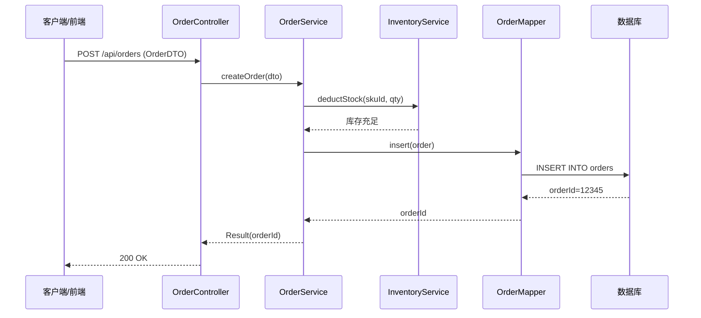
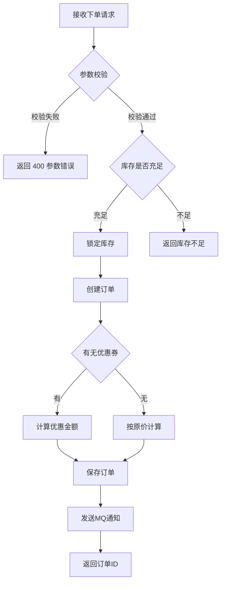
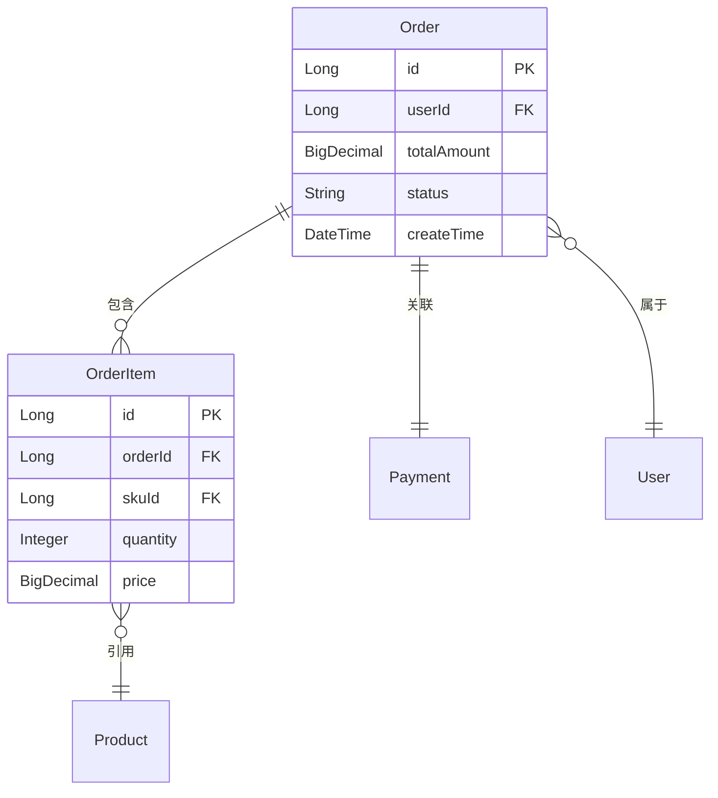

# Mermaid 图表写法参考

供 aggregator.py 生成 Mermaid 代码时参考，也可用于手动编辑 HTML 中的图表。

## 1. 时序图 (Sequence Diagram)

最常用——描述一个 API 请求从客户端到数据库的完整调用链路。



**箭头含义：**
- `->>` 实线箭头（同步调用）
- `-->>` 虚线箭头（返回/响应）
- `->>+` 激活目标
- `-->>-` 返回并停用

## 2. 流程图 (Flowchart)

描述包含条件分支的业务决策流程。



**节点形状：**
- `[ ]` — 矩形（普通步骤）
- `{ }` — 菱形（条件判断）
- `(( ))` — 圆形
- `[( )]` — 圆角矩形（数据库）

## 3. 实体关系图 (ER Diagram)

描述数据模型之间的关系。



## 4. 常用电商模式速查

### 下单流程时序图

```
sequenceDiagram
    Client->>OrderController: POST /order/create
    OrderController->>OrderService: createOrder(dto)
    OrderService->>InventoryService: checkStock(items)
    InventoryService-->>OrderService: stock OK
    OrderService->>InventoryService: lockStock(items)
    OrderService->>CouponService: validateCoupon(code)
    CouponService-->>OrderService: discount
    OrderService->>OrderMapper: insert(order)
    OrderService->>MQService: sendMessage("order.created")
    OrderService-->>OrderController: orderId
    OrderController-->>Client: 200 {orderId}
```

### 退款流程时序图

```
sequenceDiagram
    Client->>RefundController: POST /refund/apply
    RefundController->>RefundService: applyRefund(orderId, reason)
    RefundService->>OrderService: getOrder(orderId)
    OrderService-->>RefundService: order
    RefundService->>PaymentService: refund(order.paymentId, amount)
    PaymentService-->>RefundService: refundId
    RefundService->>InventoryService: restoreStock(items)
    RefundService->>OrderService: updateStatus(orderId, REFUNDING)
    RefundService-->>RefundController: refundId
    RefundController-->>Client: 200 {refundId}
```

### 秒杀流程流程图

```
flowchart TD
    A[接收秒杀请求] --> B{活动进行中?}
    B -->|否| C[返回活动未开始/已结束]
    B -->|是| D{用户已参与过?}
    D -->|是| E[返回不能重复参与]
    D -->|否| F{库存 > 0?}
    F -->|否| G[返回已抢光]
    F -->|是| H[扣减库存]
    H --> I{扣减成功?}
    I -->|失败| G
    I -->|成功| J[创建订单]
    J --> K[发送抢购成功通知]
    K --> L[返回下单成功]
```

## 常见问题

### Mermaid 图太大/太小
在 HTML 的 `<pre class="mermaid">` 外层的 `.mermaid-block` 可以用 CSS 调整尺寸。

### 中文显示问题
Mermaid 支持中文，但部分特殊字符需要引号包裹。aggregator.py 已经自动处理。

### CDN 加载失败
现象：图表区域显示「Mermaid.js 未加载」。
解决：下载 `mermaid.min.js` 放到 HTML 同目录，刷新页面。
